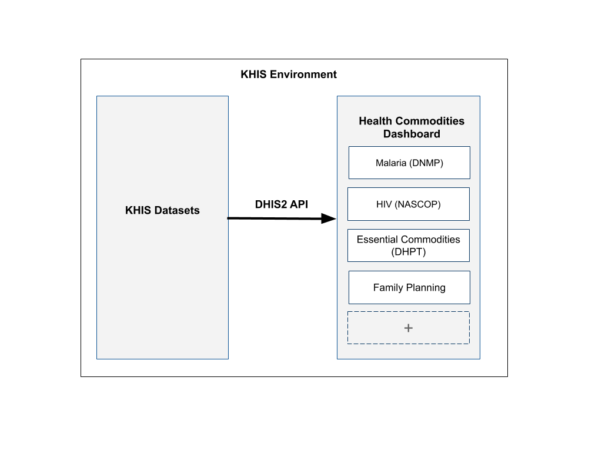
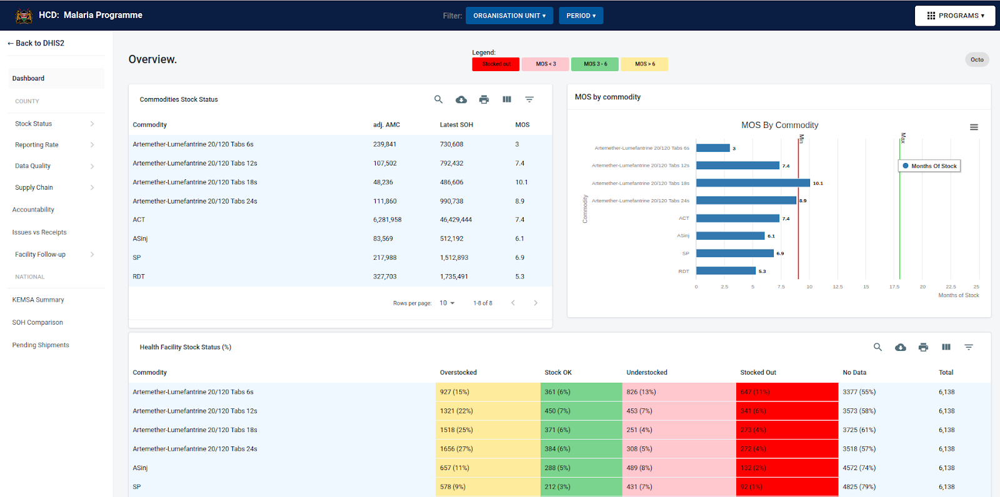
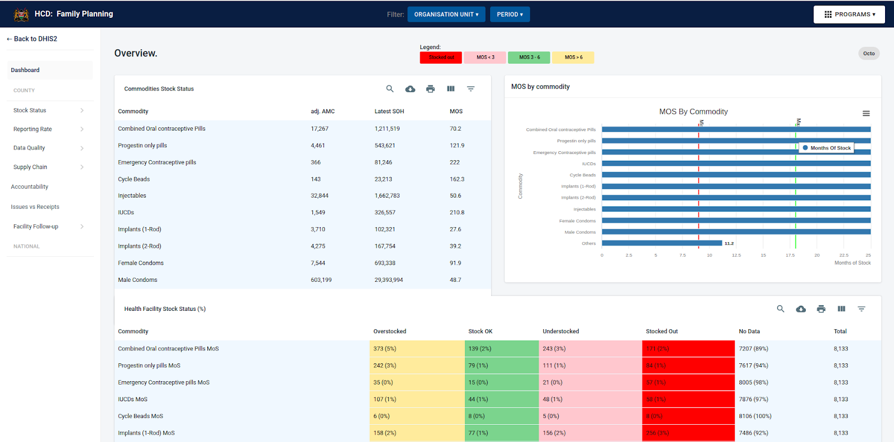
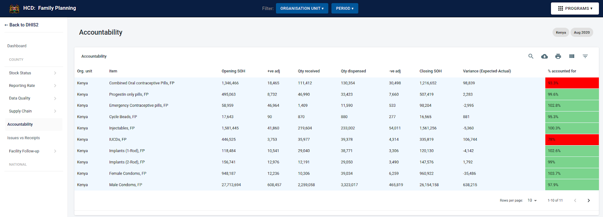
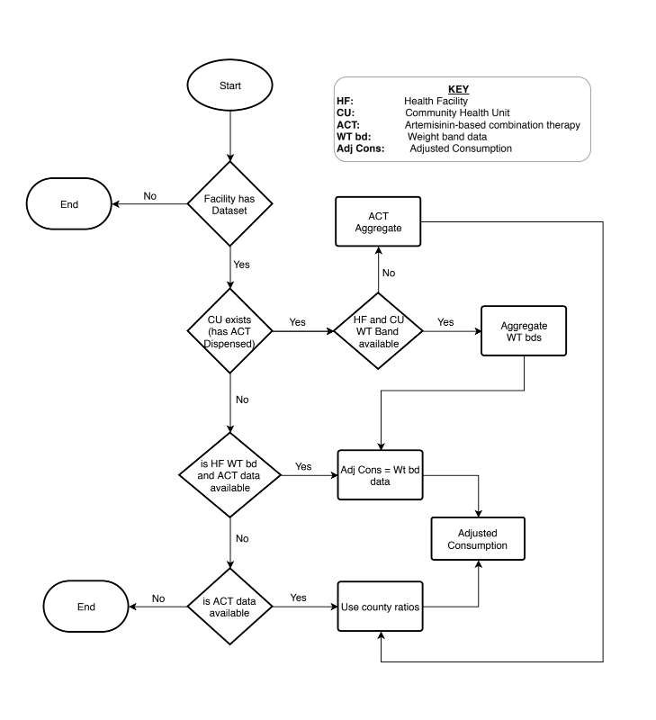

# **Ministry of Health**

## **Health Commodities Dashboard**

#### **Technical Documentation**

Draft 1 | 2nd November, 2020

---

## **Introduction &amp; description**

The Health Commodities dashboard (HCD) is an [**open-source**](https://github.com/uonafya/hcd-dashboard) web application developed for the Ministry of Health, Kenya by USAID HealthIT as part of its mandate to strengthen health information systems in the country.

The Health Commodities Dashboard is hosted within Kenya Health Information System (KHIS), an aggregate platform for all health data in Kenya based on DHIS2.

You can find a running online [**demo site here**](http://41.89.94.99:8888/).

### **Purpose / SRS**

The Health Commodities Dashboard was developed as a tool to give insight on the stock level management of health commodities in Kenya.

Commodity management in this case is managed on program basis. A program in this case referring to the various departments of the Ministry of Health and its partners, to manage implementation of various health needs/gaps in the country.

Some of these programs are:

- DHPT (Department of Health Products and Technologies)
- DNMP (Division of National Malaria Program)
- NASCOP (National AIDS &amp; STIs Control Program)
- Nutrition Department
- Family Planning Department
- Essential Medicines &amp; Medical Supplies (EMMS)

Initially, HealthIT in partnership with Afya Ugavi, KEMSA and MoH HIS developed a commodity dashboard for the Malaria Program (DNMP). With the success of this project, it became apparent that such a tool would be useful for other programs as well.

Each of these programs/departments is tasked with, among other mandates, commodity management.

The Health Commodity Dashboard provides a utility to overview commodity use, stock levels, distribution & supply chain status for each of these programs.

## **Quick start / development setup guide**

This is a quick guide to help you set up a local development instance of the Health Commodities Dashboard. You will need a computer that can comfortably run a NodeJS environment.

- [**Download from Github**](https://github.com/benzerbett/gcd-dash/archive/master.zip) or clone the repo: **git clone https://github.com/benzerbett/gcd-dash.git**
- Make sure your NodeJS and npm versions are up to date for React 16.8.6
- Clone the server (separate repo): **cd server &amp;&amp; git clone**** https://github.com/uonafya/gcd-middleware ./**
- Set up and start the development server: **cd server &amp;&amp; npm install (**More elaborate instructions given in [**the server repository**](https://github.com/uonafya/gcd-middleware)**)**
- Install client dependencies: **npm install**
- Start the server (on a separate terminal window): **cd server &amp;&amp; npm run dev**
- Server will start on: [**localhost:3000**](http://localhost:3000/)
- Start the client: **npm start or yarn start**
- Dashboard will load on on: [**localhost:8888**](http://localhost:8888/)

## **System architecture**

There are a number of factors that we took into consideration during the development of HCD. These are:

- #### **Reliability:**
  - We used tried and tested technologies and libraries in the development of this project. All these are well documented and have been used in popular systems

- #### **Performance:**
  - We have implemented data caching, code reuse, low static-resource use to ensure HCD runs efficiently in most user environments. With continuous optimization and adoption of constantly evolving technologies, the HCD will keep getting better and faster with each update.

- #### **Sustainability:**
  - To ensure long-term relevance and support and with HealthIT's push to use and support open-source technologies, the HCD project, just like its native host environment (DHIS2) is fully open-source and utilizes open-source technologies.

- #### **Adaptability/portability:**
  - Although HCD is a DHIS2 packaged application, it can very well run in an environment outside of DHIS. With a few tweaks to production instances of HCD, the project can be made to run on any compatible environment.

Health Commodities Dashboard is a React JS web application built using the technologies listed in the technologies section below.

This is made possible by the modular design of HCD, where programs and its respective commodity indices can be easily added or removed.

### **Data flow model: **

### **File Structure**

Within the download you'll find the following directories and files:

```
  ├─── package.json
  ├─── README.md
  ├─── config
  ├─── public
  ├─── server
  └─── src
  ├─── assets
  ├─── common
  ├─── components
  ├─── helpers
  ├─── icons
  ├─── layouts
  ├─── theme
  ├─── views
  │ ├─── Accountability
  │ ├─── Dashboard
  │ ├─── DataQuality
  │ ├─── HFFollowup
  │ ├─── IssuesReceipts
  │ ├─── Landing
  │ ├─── National
  │ ├─── NotFound
  │ ├─── ReportingRate
  │ ├─── StockStatus
  │ ├─── SupplyChain
  ├── App.jsx
  ├── index.jsx
  └── Routes.jsx
```

### **System layout &amp; UI:**

We adopted **Material-UI** as a design system, component library and style guide for the Health Commodities Dashboard. We settled on this for the following reasons:

- Material-UI is a mature, well-documented and widely used design system that is also open-source. It also has a comprehensive [**component library**](https://material-ui.com/) for React that allows fast prototyping, development &amp; updates.
- Since DHIS2 also uses Material-UI, the Health Commodities Dashboard fits in as part of KHIS


Here are some screengrabs showing the layout:



_Malaria Dashboard_



_Family Planning Dashboard_



_Accountability Page_

### **Environments, technologies &amp; stack in use:**

#### **Tech stack**

Since sustainability and longevity are some of the key concerns in the development of this project, we opted to use mature, open-source technologies, frameworks and libraries. These are:

- #### **Node JS:**
  - NodeJS is the primary environment for web development, especially frontend applications such as HCD. Node JS comes with a comprehensive package repository and manager: NPM.
  - When we started this project, we used NodeJS version 10.22 and NPM version 6.14. We however recommend that you use the latest version of NodeJS and all other libraries &amp; applications, unless otherwise specified.
  - To install NodeJS, follow instructions given in [**nodejs.org/en/download/**](https://nodejs.org/en/download/) for your specific environment

- #### **React JS:**
  - We used React as the main framework to develop HCD. We chose React as it is the most popular and widely used web application framework in use at the moment. There is also an immense number of compatible NPM libraries that have been tried and tested.
  - The React version in use is 16.8.6. This is the most stable version for us at the moment with the libraries in use.

- #### **Material UI:**
  - Material UI is a mature open-source design system and component library. It is stable and well-documented. We picked it for these reasons and that DHIS2 uses this UI design. This will make HCD fit in well as a DHIS2 application.
  - The version in use here is 4.2.1. We also use Material-UI datatables version 2.14.0

- #### **Express JS:**
  - Express JS is a popular javascript microframework to quickly build web apps. It is flexible, well documented and has a fairly large number of plugins to enhance its features.
  - In this context, we used Express JS to create a middleware between KHIS and the dashboard. This is mainly used during development.
  - This middleware is in a separate repository as it is not used in the main HCD application when deployed to KHIS.
  - The middleware repository is [**github.com/uonafya/gcd-middleware**](https://github.com/uonafya/gcd-middleware)

- #### **Highcharts:**
  - Highcharts is a popular charting library that has a comprehensive list of features and visualization options, established support base and comprehensive documentation.
  - Highcharts is also free to use in open-source projects. We chose it for these reasons. We use highcharts version 8.0.4 and highcharts-react-official version 2.2.0

#### **Environments**

##### **KEMSA LMIS:**
  - Some of the data visualized in the Health Commodities dashboard is from KEMSA. These include:
    - Commodity orders by counties,
    - Monthly consumption rates at counties, sub counties and facilities
    - Stock levels at KEMSA, pending shipments etc
  - In some cases, the data fetched from KEMSA has to be run through some calculations before submission to KHIS. These include:
    - Calculating average monthly consumption

##### **KHIS:**
  - **DHIS2 API:**
    - KHIS has an API interface that allows third party applications to access data. One has to be authenticated to access data in KHIS. However, for embedded applications such as HCD, authentication is not required once the app is deployed to KHIS.
    - You can read up on the [**KHIS API here**](https://docs.dhis2.org/2.28/en/developer/html/webapi.html#webapi_introduction) **.**

  - **Authentication:**
    - HCD is a KHIS-embedded app. This means that in this case, authentication does not need to be handled as API access will be within the DHIS2 environment.
    - However, in development environments, you need to use the middleware mentioned in this document. Refer to the [**middleware repository**](https://github.com/uonafya/gcd-middleware/blob/master/README.md) on how to set this up.

  - **Deployment to KHIS:**
    - For deployment, the Health Commodities Dashboard is run through a build process that generates a packaged app.
    - A packaged web app is an Open Web App that has all of its resources (HTML, CSS, JavaScript, app manifest, and so on) contained in a zip file. It can be uploaded to KHIS directly through a user interface for deployment. The mentioned[**app manifest**](http://www.w3.org/2008/webapps/manifest/), which must be named _manifest.webapp_, tells KHIS about the app installed, access rights etc. It is also used in versioning the app in KHIS.
    - Here is the current manifest in use is as follows:

```json
{
 version :  0.0.6 ,
  name :  Health Commodities Dashboard - Alpha ,
  appType :  APP ,
  description :  App to Visualize Health Commodities data ,
  icons : {
    48 :  images/logo-icon.png 
  },
  developer : {
    url :  https://healthit.uonbi.ac.ke ,
    name :  HealthIT 
  },
  activities : {
    dhis : {
      href :  https://hiskenya.org 
    }
  },
  launch\_path :  index.html ,
  default\_locale :  en 
}
```

- Once you have a packaged app zip file, you can follow [**this guide**](https://docs.dhis2.org/2.28/en/developer/html/apps_installing_apps.html) in the DHIS2 documentation on how to upload/deploy it to KHIS.

## **Programs & Modularity:**

- As mentioned previously, the Health Commodities Dashboard is built with modularity in mind when it comes to managing programs.
- In HCD, each program is packaged as an **object** in a module called [**hcd-config**](https://github.com/uonafya/hcd-dashboard/tree/master/config). It is a local node/npm package that comes bundled in the codebase. The file structure of the module is as follows:

```
└─── config
├─── endpoints/
│ ├─── fp.js
│ ├─── hiv.js
│ ├─── malaria.js
│ └─── tb.js
├─── endpoints.js
├─── index.js
├─── package.json
└─── programs.js
```

- For each program, there is a file in the **endpoints** folder within the config module. This file contains all the endpoints required in HCD. To do this, we use an [**endpoint directory**](https://docs.google.com/spreadsheets/u/0/d/1kglTMimWdM5U_PspSsaANEeOS8kPL-4coqmpSOFZdNY/edit) to collate all these API endpoints then compile that to a file that can be dropped here. Thereafter, the **endpoints.js** and **programs.js** files are updated to reflect the new additions/edits.

- As of the writing of this documentation, these are the programs that have been added:
  - Malaria Program
  - Family Planning
  - HIV
  - Nutrition
  - Tuberculosis
  - Essential Medicines &amp; Medical Supplies (EMMS)

### **Malaria Program**

- As at the time of writing this documentation, we have data of seven (7) malaria commodities visualized in HCD.
- For the purpose of calculating the months of stock for the health facilities, we calculate the aAMC(adjusted average monthly consumption). To calculate this value, **consumption data** and **weight band data** for the last **6 months** is used. The figure below demonstrates the calculation workflow.



- To determine stock level statuses for the Malaria program, we have [**set thresholds**](https://docs.google.com/spreadsheets/d/1z2j0siKUZxVOLAxqkLP0K7kxgy5ZJ02DrGJviZ6BvH4/edit#gid=0) for months of stock of each commodity, at national (KEMSA) and health facility (SOH) levels. These are as follows:

|
**Name** |
**Unit of measure** | **Thresholds** |
| --- | --- | --- |
| **National Minimum (Understocked)** | **National Maximum (Overstocked)** | **Facility Minimum (Understocked)** | **Facility Maximum (Overstocked)** |
| Artemether-Lumefantrine 20/120 Tabs 6s | Doses | 9 Months of Stock | 18 Months of Stock | 3 Months of Stock | 6 Months of Stock |
| Artemether-Lumefantrine 20/120 Tabs 12s | Doses | 9 Months of Stock | 18 Months of Stock | 4 Months of Stock | 7 Months of Stock |
| Artemether-Lumefantrine 20/120 Tabs 18s | Doses | 9 Months of Stock | 18 Months of Stock | 5 Months of Stock | 8 Months of Stock |
| Artemether-Lumefantrine 20/120 Tabs 24s | Doses | 9 Months of Stock | 18 Months of Stock | 6 Months of Stock | 9 Months of Stock |
| Artesunate Injection | Vials | 9 Months of Stock | 18 Months of Stock | 7 Months of Stock | 10 Months of Stock |
| Sulphadoxine Pyrimethamine Tabs | Tablets | 9 Months of Stock | 18 Months of Stock | 8 Months of Stock | 11 Months of Stock |
| Rapid Diagnostic Tests | Kits | 9 Months of Stock | 18 Months of Stock | 9 Months of Stock | 12 Months of Stock |

### **Family Planning**

- There is data for eleven (11) family planning commodities visualized in the Health Commodities Dashboard.
- To calculate the average monthly consumption for Family Planning commodities, an **average of consumption** in the last **six months** is used, i.e:

_Sum of consumption data for the last 6 months divided by 6_

### **HIV**

- In HCD, HIV commodities are sixty (60). These have been categorized into four (4) groups namely:

1. Opportunistic Infections (OI) medicines
2. TB/HIV drugs
3. Adult preparations
4. Paediatric preparations
5. ~~HIV lab commodities~~

- In the Health Commodities Dashboard, there is a program section for each of these commodity groups.
- To calculate the average monthly consumption for Family Planning commodities, an **average of consumption** in the last **six months** is used, i.e:

_Sum of consumption data for the last 6 months divided by 6_

### **Nutrition**

- There is data for fifteen (15) nutrition commodities visualized in HCD.
- To calculate the average monthly consumption for Nutrition commodities, an **average of consumption** in the last **six months** is used, i.e:

_Sum of consumption data for the last 6 months divided by 6_

### **Tuberculosis**

- There are 6 categories of TB commodities namely:

1. Drug Sensitive TB Medicines
2. Prophylaxis Medicines
3. Leprosy Medicines
4. Drug Resistant TB Medicines
5. Nutritional Food Supplements
6. Ancillary Medicines (Other)

- In total, there are thirty-nine (39) TB commodities with data visualized in HCD
- To calculate the average monthly consumption for Nutrition commodities, an **average of consumption** in the last **six months** is used, i.e:

_Sum of consumption data for the last 6 months divided by 6_

### **EMMS**

- There are 4 categories of EMMS commodities namely:

1. Medicines
2. Medical Supplies
3. Radiology Items
4. Medical Laboratory (Diagnostic)

- In total, there are sixty-one (61) EMMS commodities with data visualized in HCD
- To calculate the average monthly consumption for Nutrition commodities, an **average of consumption** in the last **six months** is used, i.e:

_Sum of consumption data for the last 6 months divided by 6_


## Appendix

### **Abbreviations**

1. KHIS - Kenya Health Information System
2. MOH - Ministry of Health
3. HIS - Health Information Systems
4. HCD - Health Commodities Dashboard
5. DHIS2 - District Health Information Software 2
6. DNMP - Division of National Malaria Program
7. NASCOP - National AIDS &amp; STIs Control Program
8. DHPT - Division of Health Products &amp; Technologies
9. EMMS - Essential Medicines &amp; Medical Supplies
10. UNES - University of Nairobi Enterprises &amp; Services Ltd.
11. UoN - University of Nairobi

### **Resources**

- API Server (ExpressJS):[**github.com/uonafya/gcd-middleware**](https://github.com/uonafya/gcd-middleware)
- DHIS2:[**hiskenya.org**](https://hiskenya.org/)